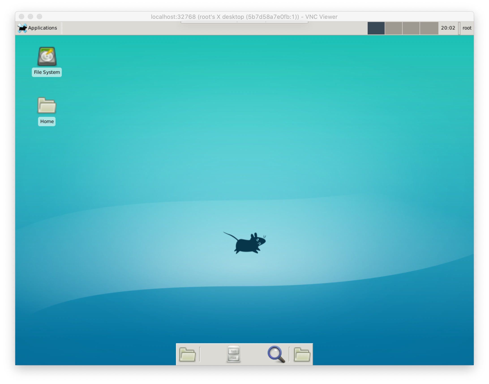

# Flutter development environment


### Build image

```shell
$ docker image build . -t ubuntu_vncserver_1
```

### Start container

```shell
$ docker run -it -P ubuntu_vncserver_1 /bin/bash
```

### Start vncserver

To connect to the container via VNC, you can use : [RealVNC](https://www.realvnc.com/en/connect/download/viewer/macos/)

```shell
$ vncserver
```

### Result

